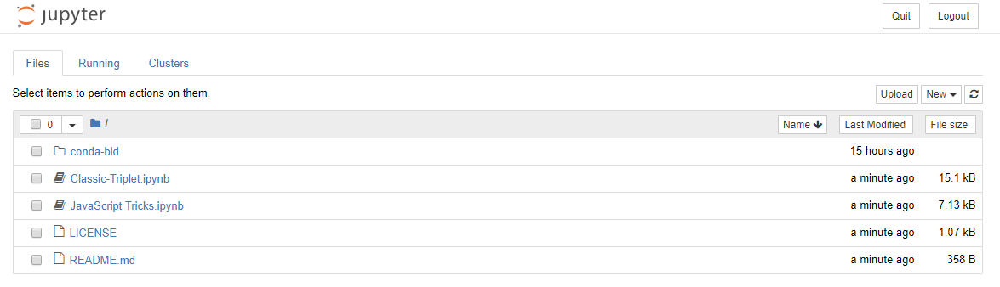

# notebooks
A collection of Jupyter notebooks.

## binder
Clicking the `launch binder` badge, above, will allow you to interact with the notebooks. Of course it is always an option to click on the notebook and GitHub will statically render it. Here is what the binder looks like.

## License
(c) 2018 Garve Hays

Released under the [MIT License](https://opensource.org/licenses/MIT); see [LICENSE](https://github.com/gkhays/notebooks/blob/master/LICENSE).
