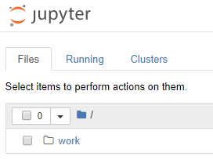

[](https://mybinder.org/v2/gh/gkhays/notebooks/master)

# notebooks
A collection of Jupyter notebooks.

## binder
Clicking the `launch binder` badge, above, will allow you to interact with the notebooks. Of course it is always an option to click on the notebook and GitHub will statically render it. Here is what the binder looks like.


## Docker

It is a big productivity gain to host notebooks in a Docker container. To use the provided `docker-compose.yml` file start (or compose) a container with
```bash
docker-compose up -d
```
Then you will need to take a quick look in the logs for the `URL` including the token.
```bash
λ docker logs datascience
/usr/local/bin/start-notebook.sh: ignoring /usr/local/bin/start-notebook.d/*

Container must be run with group "root" to update passwd file
Executing the command: jupyter notebook
[I 20:41:07.050 NotebookApp] Writing notebook server cookie secret to /home/jovyan/.local/share/jupyter/runtime/notebook_cookie_secret
[W 20:41:07.509 NotebookApp] WARNING: The notebook server is listening on all IP addresses and not using encryption. This is not recommended.
[I 20:41:07.575 NotebookApp] JupyterLab extension loaded from /opt/conda/lib/python3.6/site-packages/jupyterlab
[I 20:41:07.575 NotebookApp] JupyterLab application directory is /opt/conda/share/jupyter/lab
[I 20:41:07.589 NotebookApp] Serving notebooks from local directory: /home/jovyan
[I 20:41:07.589 NotebookApp] The Jupyter Notebook is running at:
[I 20:41:07.589 NotebookApp] http://(c3049551ac51 or 127.0.0.1):8888/?token=3161eb872bc06749824b8e998cef6d572e440e254daf77e3
[I 20:41:07.589 NotebookApp] Use Control-C to stop this server and shut down all kernels (twice to skip confirmation).[C 20:41:07.589 NotebookApp]

    Copy/paste this URL into your browser when you connect for the first time,
    to login with a token:
        http://(c3049551ac51 or 127.0.0.1):8888/?token=3161eb872bc06749824b8e998cef6d572e440e254daf77e3
[I 20:42:25.143 NotebookApp] 302 GET / (172.17.0.1) 0.94ms
[I 20:42:25.153 NotebookApp] 302 GET /tree? (172.17.0.1) 1.08ms
```

I used the [datascience-notebook](https://hub.docker.com/r/jupyter/datascience-notebook/) from the [Jupyter Docker Science Stack](https://jupyter-docker-stacks.readthedocs.io/en/latest/index.html).

Note: This image presents a `work` folder as a top-level directory, so navigating into it will take you to the available notebooks. E.g.



## License
(c) 2018 Garve Hays

Released under the [MIT License](https://opensource.org/licenses/MIT); see [LICENSE](https://github.com/gkhays/notebooks/blob/master/LICENSE).
